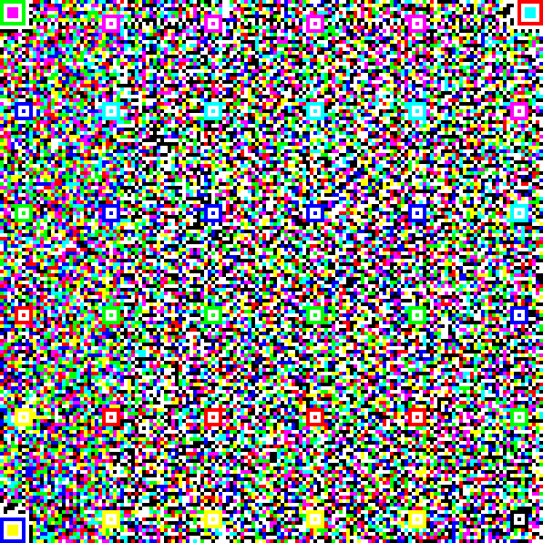

# AuthPaper and HiQ: High Capacity Color QR Codes
This is the official github for the research project AuthPaper: Protecting Paper-based Documents / Credentials Using Authenticated 2D Barcodes and HiQ: Robust and Fast Decoding of High-Capacity QR Codes

More project details can be found here : http://authpaper.net .

Both works are developed upon [ZXing](https://github.com/zxing/zxing).

The source code of this project has been used in https://authpaper.com, a company providing document anti-forgery solutions.

If you are using this work, please cite the following papers:
```bibtex
@article{yang2018robust,
  title={Robust and fast decoding of high-capacity color QR codes for mobile applications},
  author={Yang, Zhibo and Xu, Huanle and Deng, Jianyuan and Loy, Chen Change and Lau, Wing Cheong},
  journal={IEEE Transactions on Image Processing},
  volume={27},
  number={12},
  pages={6093--6108},
  year={2018},
  publisher={IEEE}
}
@inproceedings{yang2016towards,
  title={Towards robust color recovery for high-capacity color QR codes},
  author={Yang, Zhibo and Cheng, Zhiyi and Loy, Chen Change and Lau, Wing Cheong and Li, Chak Man and Li, Guanchen},
  booktitle={Image Processing (ICIP), 2016 IEEE International Conference on},
  pages={2866--2870},
  year={2016},
  organization={IEEE}
}
@inproceedings{Li2015authpaper,
  title={AuthPaper - Protecting Paper-based Documents/ Credentials using Authenticated 2D Barcodes},
  author={Li, Chak Man and Hu, Pili and Lau, Wing Cheong},
  booktitle={IEEE International Conference on Communications},
  pages={},
  year={2015},
  organization={IEEE}
}
@inproceedings{Li2014MobiSys,
  title={Demo: AuthPaper - Protecting Paper-based Documents/ Credentials using Authenticated 2D Barcodes},
  author={Li, Chak Man and Hu, Pili and Lau, Wing Cheong},
  booktitle={ACM MobiSys},
  pages={},
  year={2014},
  organization={}
}
```
For the Authpaper project, this code base consists of our modified zxing core library, a Tomcat webapp for creating QR codes with or without digital signature, and an Android-based QR code scanner application which scans the Authenticated QR codes and color QR codes created from this project.

For the HiQ project, the code base consists of a desktop-based generator, decoder, MatLab code on training the color classifer and some HiQ examples.
Users may use the mobile application to scan the HiQ, with proper color classifier.

Prerequisites
---

- libsvm (for matlab code in HiQ project)
- ZXing (for other modules)

Code Contributors
---
- Chak Man Li
- Zhibo Yang
- Guanchen Li

Color QR code Dataset: CUHK-CQRC
---
A dataset containing more than 5k color QR codes images captured by a variety of smartphones under different lighting conditions.

http://authpaper.net/colorDatabase/index.html

[Download](http://www.authpaper.net/colorDatabase/cuhk-cqrc/.)

Example HiQ Codes
---
    

