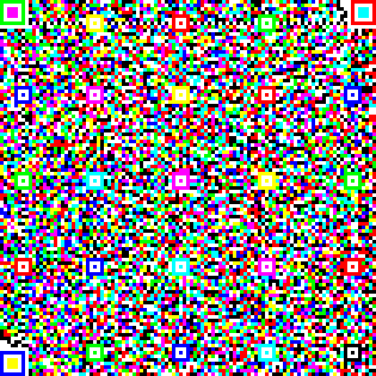

# HiQ: High Capacity Color QR Codes
Implementation of HiQ codes, including source code for a desktop HiQ codes generator and the core of HiQ codes decoder for Android platform written in Java. This repository also includes two algorithms for solving the cross-module color interference written in Matlab. 

This work is developed upon [ZXing](https://github.com/zxing/zxing).

If you are using this work, please cite the following papers:
```bibtex
@article{yang2018robust,
  title={Robust and fast decoding of high-capacity color QR codes for mobile applications},
  author={Yang, Zhibo and Xu, Huanle and Deng, Jianyuan and Loy, Chen Change and Lau, Wing Cheong},
  journal={IEEE Transactions on Image Processing},
  volume={27},
  number={12},
  pages={6093--6108},
  year={2018},
  publisher={IEEE}
}
@inproceedings{yang2016towards,
  title={Towards robust color recovery for high-capacity color QR codes},
  author={Yang, Zhibo and Cheng, Zhiyi and Loy, Chen Change and Lau, Wing Cheong and Li, Chak Man and Li, Guanchen},
  booktitle={Image Processing (ICIP), 2016 IEEE International Conference on},
  pages={2866--2870},
  year={2016},
  organization={IEEE}
}
```

Prerequisites
---

- libsvm (for matlab code)
- ZXing (for desktop HiQ codes creator and decoder)

Code Contributors
---
- Chak Man Li
- Zhibo Yang

Color QR code Dataset: CUHK-CQRC
---
A dataset containing more than 5k color QR codes images captured by a variety of smartphones under different lighting conditions.

http://authpaper.net/colorDatabase/index.html

Example HiQ Codes
---
    

**More details to come...** 
